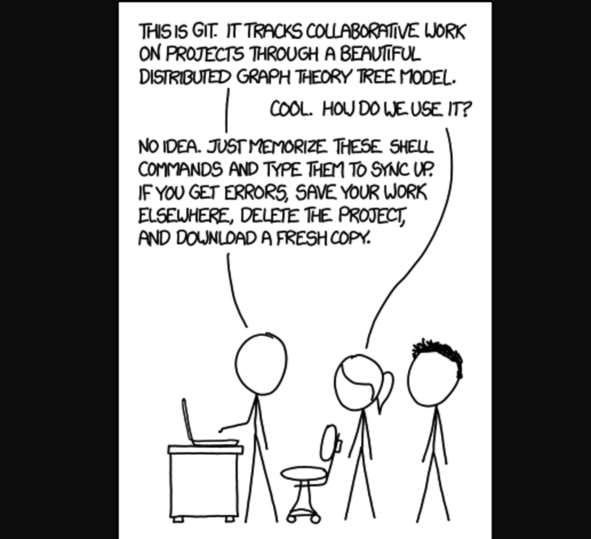

# Wtf is git

So yall here to learn about this thing called git. wtf is it?


Totally stolen from this guys [blog](https://codeburst.io/so-wtf-is-git-fa7daa0e0271).

## What is git

Git is a version control system used to track changes on files on your computer. It is most widely used for managing and maintaining source code for software. It was built by the all mighty Linus Torvalds, he built git because it was getting too difficult to maintain the Linux project.


This is a very oversimplied image of how the basics of git works.


But this base model is where we will start.

## Let's start

Soooo, lets start playing around with some shell commands. At this point I am assuming you have git install on your machine. We are going to use git on the terminal, sorry no GUI application. If you on Linux/OSX it should be installed.

For Windows i duno figure it out.

First thing, create a folder for the project which your are going to work off.

Open up your terminal and navigate to that folder.

We are going to use our first git command. 

```shell
git init
```
This will initialize the folder with a hidden folder called `.git` which git uses to do all of its magic. There will be no reason for you to ever navigate that folder, unless you done goofed even then you never have to go there or should go there, there are other ways around it.

```shell
git status
```

This is probably one of the most used git commands, now type `git status` into your project folder. This will give you a status of the folder you are in, if anything has changed or not, which branch are you in pretty useful stuff.

Let's type `git status` in your terminal.

It'll say something along the lines of :
```shell
On branch master

No commits yet

nothing to commit (create/copy files and use "git add" to track)
```

Cool lets change something, lets add a file in your empty folder name it README.md.
Using your favorite text editor copy add this line in there:
```markdown
First line
```
Save your file now and go back to your terminal and type `git status`

It will now mention that there is a untracked file called README.md
So `git` has recognized that there is a new file and it isn't tracking it, which will bring us to our next command.

```shell
git add
```
`git add [filename]` will tell git to add the changes and start tracking them.

Lets add the new file you created `git add README.md`.
Now do `git status` again to see what the status of your project is.
It'll say that there is a new file called `README.md` and that it has changes to be committed.
Which brings us to our next command.

```shell
git commit
```
`git commit` creates a new version of the file with the changes you have done and save it in that mysterious `.git` folder i told you not go into.
It has is own structure on how this thing is done.
Lets commit our changes that we have done to the README.md file.
```shell
git commit -m "first commit"
```
This will now create a commit to all the changes that were made to the files you add using `git add` .
The `-m` flag is the commit message, this is required, this mentions what was changed in this commit. Using `-m` is the short form writing a commit message.
You could've also done `git commit` which would've brought up our default terminal text editor either `nano` or `vim`.

So now that your have committed your changes that means they are recorded the changes to the ledger that git uses.
Lets see this ledger:
```shell
git log
```
You'll see something along the lines of:
```shell
commit 31e94c0c05d8ee7f488db92be4e687f3bf5d22ab (HEAD -> master)
Author: Sonal Ranjit <sonal.ranjit3@gmail.com>
Date:   Mon May 7 13:19:24 2018 -0400

    initial commit
```
The log will get longer the more commits you have obviously, the things to keep note for is the commit id which is that long mumbo jumbo string `31e94c0c05d8ee7f488db92be4e687f3bf5d22ab` that is a unique string that identifies a version of the this project and allows us to go jump back into it at anytime. We'll go into this feature a little bit later.

Okay once you have committed your changes they are recorded as a version referenced by the commit id. If you hit `git status` now then it will say working directory is clean meaning nothing has changed since the last commit.
So everything you have done has been done locally on your machine, lets look into how we use `git` for collaboration. 
The way we do this is we will host a copy of your local project (repository) on the web, `git` refers to this as `remote`. So we will now setup a remote location to host our project, `git` refers to this as repository (code repository).

Lets use github to host our repo. Log into github and create a repository and name it `gitgud` make sure it's empty. 
Copy the url to your git repo and come back to your terminal.

```shell
git remote add origin https://github.com/user/repo.git
```

Verify it by:
```shell
git remote -v
```
Great now that you have specified a path to your remote repo lets push to it.
```shell
git push -u origin master
```
This is push changes to the remote repo defined by `origin` and the branch `master`. The `-u` flag is only used for first time push to remotes where the branch doesn't exists. We are doing this now because earlier you created an empty git repo it literally has nothing.

Verify the push was done by checking your github and you should see your README.md file with the line you inserted. If you navigate to your commits then you will see the commit logs.

Cool lets add another line to the README, write whatever you want save and do the whole process of add, commit push.
```shell
git add 
git commit
git push
```
That is workflow for tracking your changes and committing versions.

Now lets get expand on this. Lets working with branches now, remember how we talked about the ledger/log git uses to keep track of changes, well if there was just one ledger it would be hard for multiple people to collaborate on the same ledger. The notion of the branch is you create a copy of a ledger from another branch record your changes on that ledger so youd don't mess up the master ledger. After when you are ready to merge your changes into the master branch, we will just transfer over your changes, in that way we won't be messing up the master branch by continously pushing changes to it. You working your branch and when ready we'll merge in the changes into master branch.

```shell
git branch [branchname]
```
This is create a new branch, you can name it whatever you want. For our purposes lets call it `branch1`.

```shell
git checkout [branchname]
```
This will switch(checkout) to the branch you specified. Check using `git status` it will tell you which branch you are on.

Lets do some changes to your README, add a line saying `changes from a new branch`. Do the whole routine of `add` and `commit`.
Now if you try to push you will get a message saying this branch doesn't exists in the remote. So we'll have to use the `-u` flag to set the upstream.

```shell
git merge [branch]
```
Lets get into merging, this is where we merge changes from another branch into the one you are currently sitting on.
We are now going to merge changes into the `master` branch from the `branch1` branch.
First we checkout to our master branch.
Then we use `git merge branch1`, if things went nicely you will now see the changes you did to the README in `branch1` in the master branch now. 
Lets see if the ledger updated but typing `git log`, the commit id should be now added to the ledger from branch1.

The best practices is to delete the branch that has been merged.
```shell
git branch -d branch1
```

So you can merged the changes locally, but the remote master hasn't been updated. Since all the commits have been added to the ledger there won't be anything to add or commit. If you hit `git status` it will tell you if the branch is ahead of behind from your remote repo. A simple `git push` will just push all the commits to your remote repo, verify it by checking it on github.

Okay now lets start messing some things up, lets rollback to a previous version of the project. We'll use `git checkout` for this, now I've just shown you to use checkout to checkout to a branch. But you can use checkout to checkout to a commit id. Let's checkout to a first commit we did for the master branch. 
```shell
git checkout [commit-id]
```
Lets get the commit id by using `git log`, you don't need the whole string just the first 8. Once you got the first 2-3 just hit tab to autocomplete.
The terminal will tell you now that you are in a detached HEAD state, means you have pointed the version not the latest commit on the branch, git knows this now.
So Lets make a change in the README, add a line "detached head state".
Let's checkout to a new branch from the commit id using `git checkout -b detached`.
Do the whole thing `git add, git commit -m "message"`.

Lets go back to the master branch now and try to merge. `git merge detached`
Ooops we have a merge conflict, this happened because we branched off a commit that was older that the most recent one in the master branch and commit changes in between the latest master commit and one from the detached branch.
So open up your text editor to see the conflicts, git will outline to you where the conflicts are.
```markdown
First line

<<<<<<< HEAD
something from branch1
=======
detached head yo
>>>>>>> commiting to a detached head
```
The way to resolve this is to delete those lines that git has marked for us in the file.`<<<HEAD` marks the version of latest commit on the branch you are in and the `======` marks the incoming changes you are trying to merge from. Lets keep both so delete `<<<HEAD`, `======` and `>>>>` save. Let's add and commit now, stated this commit merged the detached branch into the master.
Phew that was big one, so that is one way to handle conflicts, this was a very simple case of a merge conflict. In a more real life settings you might have merge conflicts with multiple line conflicts and multiple files.

Cool lets get into more collaborative project, new git command now. Cloning an existing remote repo.
```shell
git clone https://github.com/sonalranjit/gitgud.git sonal-gitgud
```
Checkout a new branch with your name.
Add a new line to the TEST_README.md saying "[yourname] was here" and push it to the remote.
Now you each have updated the remote repo with your respective branch, but you don't have these changes on your local repo.
```shell
git fetch
```
`fetch` will fetch all the changes from remote but won't apply them. When you type in fetch you should've gotten a list of all new branches.

Checkout to `sonalsbranch` and type `git status`, it will tell your local branch is behind by a commit and can be fast forwarded.
One way to pull the changes from remote is `git pull`
```shell
git pull
```
This will apply the changes you fetched from the remote on to your local branch.

